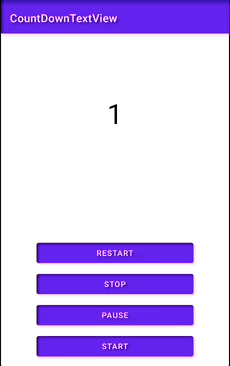

# CountDownTextView

[](https://jitpack.io/#Josh-Owen/CountDownTextView)

CountDownTextView is a lightweight library used to implement simple countdown's which can be stopped, started, paused and resumed.
The widget extends TextView behaviour and can be styled as and how you wish and includes a comprehensive list of callbacks 
for every possible event you might need to intercept. Out the box it comes with a default animation blend which which can
be switched to an animation of your choosing or disabled entirely. 



## Getting started

### Download

For detailed instructions please check out the official [Jitpack documentation](https://jitpack.io/#Josh-Owen/CountDownTextView/tag).

Additionally you can download the project from the Github's [release's page](https://github.com/Josh-Owen/CountDownTextView/releases).

Or use Gradle:

```gradle
allprojects {
    repositories {
        maven { url "https://jitpack.io" }
    }
}

dependencies {
    implementation 'com.github.Josh-Owen:CountDownTextView:1.0.0'
}
```

Or Maven:

```
<repositories>
    <repository>
        <id>jitpack.io</id>
        <url>https://jitpack.io</url>
    </repository>
</repositories>

<dependency>
    <groupId>com.github.Josh-Owen</groupId>
    <artifactId>CountDownTextView</artifactId>
    <version>1.0.0</version>
</dependency>
```
### Usage

The start and end count down values can be initialised in XML using the following code.

```
app:endTimerValue="0"
app:startTimerValue="5"
```

or alternatively it can be initialised in Kotlin. 
```
tvCounter.setStartTime(5)
tvCounter.setEndTime(0)
```

To start the countdown where we only intercept the onFinished event we can call the following.

```
tvCounter.start {
    // onFinished logic here
}
```

Your countdowns also additionally can be stopped, started, resumed, paused or restarted with the following functions.

```
tvCounter.resume()
tvCounter.pause()
tvCounter.stop()
tvCounter.restart() 
```

If you need to intercept more specific count down events you can also additionally implement the [CountDownCallback](https://github.com/Josh-Owen/CountDownTextView/blob/main/CountDownTextView/src/main/java/com/joshowen/countdowntextview/CountDownCallback.kt) interface where you will be able to intercept the following events.

```
onPause() (Optional) 
onResume() (Optional) 
onStart() (Optional) 
onStop() (Optional) 
onRestart() (Optional) 
onTick(time : Int) (Optional) 
onFinished() (Mandatory)  
```

The above events can either be implemented as an interface in your fragment or activity and passed to `start()` as a parameter or alternatively using the following sample code. 

```
        tvCounter.start(
            object : CountDownCallback {

                override fun onFinished() {
                    Log.e("CountDown: " ,"onFinished")
                }

                override fun onPause() {
                    super.onPause()
                    Log.e("CountDown: " ,"onPause")
                }

                override fun onResume() {
                    super.onResume()
                    Log.e("CountDown: " ,"onResume")
                }

                override fun onStart() {
                    super.onStart()
                    Log.e("CountDown: " ,"onStart")
                }

                override fun onStop() {
                    super.onStop()
                    Log.e("CountDown: " ,"onStop")
                }

                override fun onRestart() {
                    super.onRestart()
                    Log.e("CountDown: " ,"onRestart")
                }

                override fun onTick(time: Int) {
                    super.onTick(time)
                    Log.e("CountDown: " , "Tick: $time")
                }
            }
        )
```

As well as providing callbacks, the library also comes out the box with a default scale and alpha animation which is demonstrated in the gif above, but this can also be disabled using the following:

In XML

```
app:pulsationEnabled="false"
```

Or in Kotlin 

```
tvCounter.enableOrDisablePulsation(false)
```

The animation can also be customised by passing a new [Scale Animation](https://developer.android.com/reference/android/view/animation/ScaleAnimation) or [Alpha Animation](https://developer.android.com/reference/android/view/animation/AlphaAnimation) to the following functions:

```
setScaleAnimation(newScaleAnimation)
setAlphaAnimation(newAlphaAnimation)
```

Note: There are code samples demonstrating the usage of CountDownTextView in the project. 

And that is all folks! I am open to suggestions in how to further improve this library to increase it's utility.

Be kind & help others. Cya!